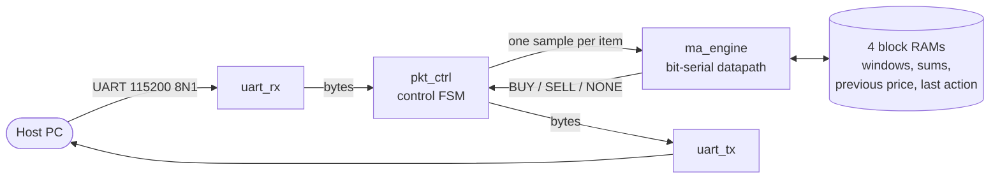

<h1 align="center">BlackList</h1>

<p align="center">
  <b>A two-item moving-average crossover trading engine in 214 logic cells.</b><br>
  GQH Hardware Track &middot; Sipeed Tang Nano 20K
</p>

<p align="center">
  
  
  
  
  
  
</p>

| | |
|---|---|
| **Team** | BlackList: Jayden, Wihl, Nico, Rishi |
| **Board** | Sipeed Tang Nano 20K (GW2AR-LV18QN88C8/I7) |
| **Languages** | SystemVerilog (RTL, testbenches, assertions), Python (tooling) |
| **Gowin EDA** | V1.9.11.03 Education |
| **Top-level module** | `top` (`src/top.sv`) |

## What it does

A host sends 8-byte requests over UART. Each one carries a price for item A and a price for item B. The FPGA
keeps a 16-price moving average for each item and answers every request with **BUY**, **SELL** or **NONE** per
item, depending on how the price crosses its average. Everything runs in FPGA logic: UART, packet handling,
state, crossing detection and the response. Prices are full unsigned 16-bit values, 0 to 65535.

## The trick: do the math one bit at a time

Our first version worked and was big: **386 logic cells and 704 registers**. Most of that was two 16-entry price
windows held in flip-flops and a set of 20-bit adders and comparators.

The contest ranks on logic count, and block RAM is free. So the final version moves *all* per-item state into
block RAM and shrinks the datapath until it is one bit wide:

- The price windows, rolling sums, previous prices and last actions live in four small block RAMs, addressed
  one bit at a time.
- A sample is processed least-significant bit first. One full adder adds the new price to the sum, one full
  subtractor removes the oldest price, and two serial comparators decide the crossing as the bits go past.
- A sample takes 23 clock cycles, under a microsecond at 27 MHz. UART time for the 16 bytes is over a
  millisecond, so the serial datapath costs nothing you can measure.
- A new session does not erase the RAM. It resets one 5-bit counter, and the warm-up samples overwrite
  everything that matters before any of it is read.

| | First version | Final |
|---|---|---|
| Logic (LUT + ALU) | 386 | **214** |
| Registers | 704 | **197** |
| Block RAM | 0 | 4 |



| Module | Role |
|---|---|
| `top` | pins and wiring |
| `por_reset` | power-on reset |
| `uart_rx`, `uart_tx` | 115200 8N1; TX inserts the idle gap between response bytes |
| `pkt_ctrl` | the one control FSM: 8 bytes in, two engine commands, 8 bytes out |
| `ma_engine` | bit-serial sum update and crossing detection over state held in block RAM |
| `ram_sdp` | small inferred block RAM (the design's only synthesis attribute, `syn_ramstyle`) |
| `gqh_pkg` | shared constants and types |

Start reading at `src/ma_engine.sv`: the header comment explains the whole scheme in twenty lines.
The longer story is in `docs/ARCHITECTURE.md`, and every design choice with its evidence is in `docs/DECISIONS.md`.

## Quick start: run it on your own board

You need a Tang Nano 20K, Gowin EDA V1.9.11.03 (for its Programmer), and Python 3.

**1. Get the code**
```
git clone https://github.com/jaydennargen/blacklist-gqh.git
cd blacklist-gqh
pip install pyserial
```

**2. Program the board.** In Gowin Programmer: SRAM Mode, SRAM Program, file `bitstream/gqh.fs`. Or from
PowerShell in the repository root (adjust the install path; `programmer_cli` needs an absolute file path, which
`Resolve-Path` supplies):
```
& "C:\Gowin\Gowin_V1.9.11.03_Education_x64\Programmer\bin\programmer_cli.exe" --device GW2AR-18C --run 2 --fsFile (Resolve-Path bitstream\gqh.fs).Path
```

**3. Find the serial port.** The board shows up as two COM ports. The UART is the second one.
```
python -m serial.tools.list_ports
```

**4. Run the organizer tests.** Set `PORT` near the top of each script to your COM port, change nothing else,
and run them back to back without reprogramming:
```
python organizer/21_quick_uart_test.py
python organizer/22_robust_uart_test.py
python organizer/22_robust_uart_test_fullrange.py
```
Expected: `PASS` from the quick test, then 84/84 scored packets and 168/168 actions correct with 0 timeouts from
each robust test.

## Rebuild the bitstream

**In the IDE:** open `gowin/gqh.gprj` in Gowin EDA V1.9.11.03 and click Run All. The project already sets the
device, top module `top`, SystemVerilog 2017, the organizer `.cst` and `constraints/gqh.sdc`. Reports and the
bitstream land in `gowin/impl/pnr/`. The Resource Usage Summary should read Logic 214, Register 197, BSRAM 4.

**From the command line** (PowerShell; point `GW_SH` at your install unless `gw_sh` is already on `PATH`):
```
$env:GW_SH = "C:\Gowin\Gowin_V1.9.11.03_Education_x64\IDE\bin\gw_sh.exe"
python tools/run.py synth
```
This builds the same project, copies the result to `bitstream/gqh.fs` and prints one line:
```
SYNTH: PASS LUT=203 ALU=8 SSRAM=0 BSRAM=4 REG=197 LOGIC=214
```

## Run the simulations

Needs QuestaSim (`vlib`, `vlog`, `vsim` on `PATH`). Generate the test vectors once, then run any test:
```
python tools/gen_vectors.py --profile all --seeds 2
python tools/run.py sim uart      --plusargs "+REQUIRE_COVERS"
python tools/run.py sim pkt_ctrl  --plusargs "+REQUIRE_COVERS"
python tools/run.py sim ma_engine --plusargs "+REQUIRE_COVERS"
python tools/run.py sim system    --plusargs "+REQUIRE_COVERS"
python tools/run.py sim system --seeds 10 --plusargs "+VEC=vectors/organizer_s1.hex"
```
Each run prints one summary line. A pass means 0 errors, 0 warnings and `TEST_RESULT: PASS`.

## The protocol

UART, 115200 baud, 8N1. Full detail in `docs/SPEC.md`.

| | Bytes, in order |
|---|---|
| Request (host to FPGA) | index (2, big-endian), item ID 1, price 1 (2, big-endian), item ID 2, price 2 (2, big-endian) |
| Response (FPGA to host) | index (2), item ID 1, action 1, item ID 2, action 2, two reserved bytes of 0 |

Item IDs are `0x11` (A) and `0x22` (B). Actions: 0 = NONE, 1 = SELL, 2 = BUY. Index 0 starts a new session;
indices 0 to 15 are warm-up and always answer NONE. Each request gets exactly one 8-byte response.

## Results

All numbers are for the committed source and `bitstream/gqh.fs`. Detail: `results/v2_board.md`.

| | |
|---|---|
| Place-and-route Resource Usage Summary | **Logic 214** (204 LUT, 10 ALU), **Register 197**, BSRAM 4 |
| Synthesis (`run.py synth`) | LUT=203 ALU=8 SSRAM=0 BSRAM=4 REG=197 |
| Timing | 27 MHz constraint met with 0 setup and 0 hold violations; post-route Fmax 164.005 MHz |
| `21_quick_uart_test.py` | PASS |
| `22_robust_uart_test.py` x 20 after an SRAM program | 1680/1680 scored packets correct, 0 timeouts |
| `22_robust_uart_test_fullrange.py` x 5, same power-up, no reprogramming | 420/420 scored packets correct, 0 timeouts |
| Average round-trip latency over the 20 robust runs | median 16.928 ms (per-run averages 16.767 to 16.941 ms) |
| Repeat on a second PC from a fresh clone, built in the Gowin IDE | same Logic / Register / BSRAM; robust x 5 all 84/84, median 16.484 ms; full-range 84/84 |

## How we know it works

Expected values never come from us. They come from the organizer's reference model: `tools/oracle.py` is a copy
of the model in `organizer/22_robust_uart_test.py`, and `tools/gen_vectors.py` uses it to produce request and
response vectors in five price profiles (`organizer`, `judge`, `cross`, `equal`, `extreme`; the last covers
prices 0 and 0xFFFF). The testbenches replay them with randomized UART timing, and assertions attach to the
design with `bind` from `testbench/common/`. The plan is in `docs/VERIFICATION.md`.

- **Regression:** all four tests pass on the committed source with every required cover hit, 0 errors, 0 warnings.
- **Random timing:** the system test compares every response with the oracle at the pins. 100/100 seeds passed
  (10 vector files x 10 seeds). This run was made on the new engine before the last `uart_tx` and `pkt_ctrl`
  changes were merged with it.
- **Mutation testing:** we broke the engine 18 different ways on purpose (wrong comparison, dropped carry,
  skipped clear, and so on). The regression caught all 18.
- **Code coverage:** statement, branch, condition and expression coverage of `ma_engine` and `ram_sdp` is 100%.
- **On the board:** 20 robust and 5 full-range organizer runs in a row without a wrong packet or a timeout.

## Repository layout
```
src/          SystemVerilog RTL (what Gowin builds)
constraints/  organizer .cst, plus gqh.sdc (27 MHz clock constraint)
testbench/    SystemVerilog testbenches and assertions (never synthesized)
gowin/        Gowin project gqh.gprj, its options in impl/gqh_process_config.json, batch build script
bitstream/    final .fs, built from the committed source
results/      board test output, CSVs and measurements
organizer/    organizer-supplied test scripts and reference notes, unmodified
docs/         spec, architecture, decisions, verification plan
tools/        run.py (sim / synth / board tests), oracle.py, gen_vectors.py
```

## External resources
- Organizer-supplied files, in `organizer/` and `constraints/19_tang_nano_20k.cst`, unmodified: the pin
  constraints, the UART test scripts (quick, robust, full-range) and their reference notes. `tools/oracle.py`
  copies the reference model from the organizer's robust test script. The Participant Guide PDF is not
  redistributed here.
- Tools: Gowin EDA V1.9.11.03 Education, QuestaSim, Python 3 with `pyserial`.

## Known limitations
- The engine does not clear its block RAM on index 0; it zeroes a sample counter. This is correct for requests
  as the organizer scripts send them: index 0 first, then indices in order, one item A and one item B per packet
  (`docs/DECISIONS.md` D10, D12, D20). The same item twice in a packet, or indices out of order, are not supported.
- Round-trip latency is about 17 ms right after an SRAM program over JTAG, while simulated wire latency is about
  2 ms. The difference appears to be on the host and USB-bridge side (`results/v1_board.md`).
- A partial request packet is discarded after 38.8 ms without a byte (`RX_TIMEOUT_CLKS`, DECISIONS D13).
- Gowin reports warning PR1014: `sys_clk` (pin 4) uses generic routing. Timing is met.
